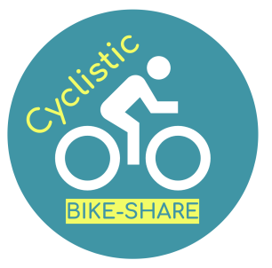

<h1>Cyclistic Bike-Share Analysis</h1>

 

<h2>Introduction</h2>

Welcome to the Cyclistic Bike-Share Analysis project! In this project, we aim to provide data-driven insights into the usage patterns of casual riders and annual members of Cyclistic, a bike-share company based in Chicago. Our goal is to uncover key differences in how these two groups utilize Cyclistic bikes, with the ultimate objective of designing a marketing strategy to convert casual riders into annual members.

<h2>Project Overview</h2>

As part of the marketing analyst team at Cyclistic, we have undertaken the following tasks:

<ol>
  <li><strong>Data Cleaning and Preparation</strong>: We performed necessary data cleaning, removed redundant columns, and converted data types to make the dataset suitable for analysis.</li>
  <li><strong>Feature Engineering</strong>: We calculated new fields and metrics from the existing data to extract valuable insights.</li>
  <li><strong>Data Visualization</strong>: We generated professional data visualizations to illustrate trends and patterns in bike usage by casual riders and annual members.</li>
  <li><strong>Ideas and Recommendations</strong>: In the sharing phase, we provided our initial ideas and recommendations backed by compelling data insights.</li>
</ol>

<h2>Getting Started</h2>

To replicate our analysis, follow these steps:

<ol>
  <li><strong>Clone the Repository</strong>: Clone this repository to your local machine using the following command: 
    <code>git clone https://github.com/BhargavGurav/Cyclistic_analysis.git</code></li>
  <li><strong>Dependencies</strong>: Make sure you have the required dependencies installed. You can find the list of dependencies in the <code>requirements.txt</code> file.</li>
  <li><strong>Data</strong>: Obtain the cleaned and prepared dataset used for analysis. You can find this dataset in the <code>data</code> directory.</li>
  <li><strong>Jupyter Notebooks</strong>: The analysis was performed in Jupyter notebooks. You can explore our code and visualizations in the <code>notebooks</code> directory.</li>
</ol>

<h2>Key Insights</h2>

Based on our analysis, we have uncovered several important insights:

<ol>
  <li><strong>Usage Patterns</strong>: Casual riders tend to use bikes more on weekends for leisurely rides, while annual members use bikes primarily for daily commuting on weekdays.</li>
  <li><strong>Trip Durations</strong>: Casual riders typically have longer trip durations compared to annual members, who often opt for shorter, more routine trips.</li>
  <li><strong>Age Distribution</strong>: The age distribution differs significantly between the two groups, with casual riders having a broader range of ages.</li>
</ol>

<h2>Future Steps</h2>

While we have made initial recommendations, there's more to explore:

<ol>
  <li><strong>User Surveys</strong>: Conduct surveys to gather direct feedback from casual riders about their hesitations in becoming annual members.</li>
  <li><strong>Promotional Campaigns</strong>: Design targeted promotional campaigns that address the specific needs and concerns of casual riders.</li>
</ol>

<h2>License</h2>

This project is licensed under the <a href="LICENSE">MIT License</a>.

<h2>Acknowledgments</h2>

We would like to express our gratitude to Cyclistic for providing the data and the opportunity to work on this analysis.

